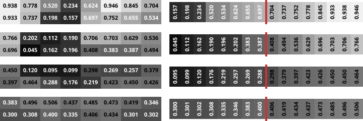

# blockhash

[](https://crates.io/crates/blockhash)
[](https://github.com/jaehl/blockhash/actions/workflows/main.yml?query=branch%3Amaster)
[](https://github.com/jaehl/blockhash/blob/master/LICENSE)

This is an implementation of the [Blockhash] algorithm for detecting similar images, and can produce 16-, 64-, 144-, and 256-bit
perceptual hashes.

Support for the [`image`] crate is provided by default, but support for any image type can be easily
added.

[Documentation](https://docs.rs/blockhash)

## Usage

```rust
use blockhash::blockhash64;

let img = image::open("images/example.png").unwrap();
let hash = blockhash64(&img);

assert_eq!(hash.to_string(), "c7c48f8989c77e0c");
```

## The Blockhash algorithm

This is a basic outline of how the algorithm works. Note that this explanation uses floating-point
numbers, but the library itself only uses integer operations in order to avoid any rounding errors.

To demonstrate the algorithm, we will calculate the 64-bit hash of the following image:


First we convert it to a grayscale image by taking the average of the red, green, and blue
components:


Then we divide the image into 64 (8×8) blocks and calculate the average brightness for all the
pixels in each block:


Next, we divide the blocks into 4 horizontal bands and find the median value for each band:



Blocks brighter than the median represent a 1 and blocks darker than the median represent a 0.
This gives us the 64 bits of the hash, read from left to right, top to bottom:


We can represent the hash as a hexadecimal string:

```
c7c48f8989c77e0c
```

## License

This project is licensed under the [MIT license](LICENSE).

[Blockhash]: https://web.archive.org/web/20210827144701/http://blockhash.io/
[`image`]: https://crates.io/crates/image
